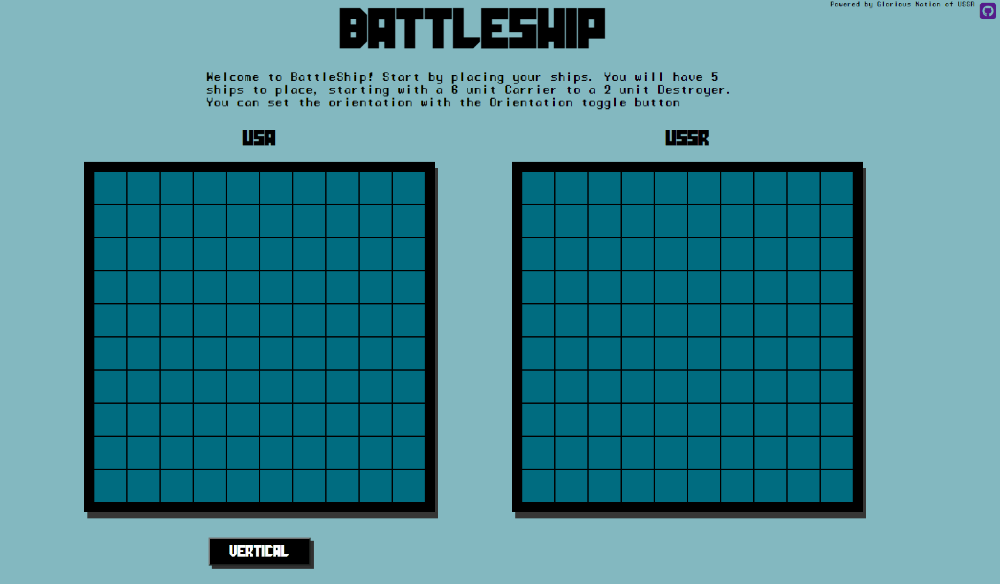

# Battleship!

Glory to USSR!

Play Battleship against the computer! Built using React to practice using Jest for testing.

Features:

    -Place 5 different size ships in horizontal or vertical orientation.
    -Cool sound effects and bright visuals!
    -Represent USA in a cold war era battle.

Demonstrated Skills:

    -Uses Jest for unit testing for Ship, Player, and Gameboard modules to facilitate fast and efficient testing of various inputs and edge cases.
    -Uses React Hooks like useState and useEffect to manage states of gameboard and players.
    -Uses useSound React Hook to have explosion sound effect when ship is hit.
    -Uses Lodash library to deep clone 2D-Gamebaord array to trigger state updates.
    -Designed ES6 module style game objects with a front-end powered by React and USSR propoganda!

Future Ways to Improve:

    -Update the computer AI so that it doesn't attack random squares.

Overall project time: ~20 hours
Date Completed: 2/04/2021

-Gary Arzumanyan

Homepage

